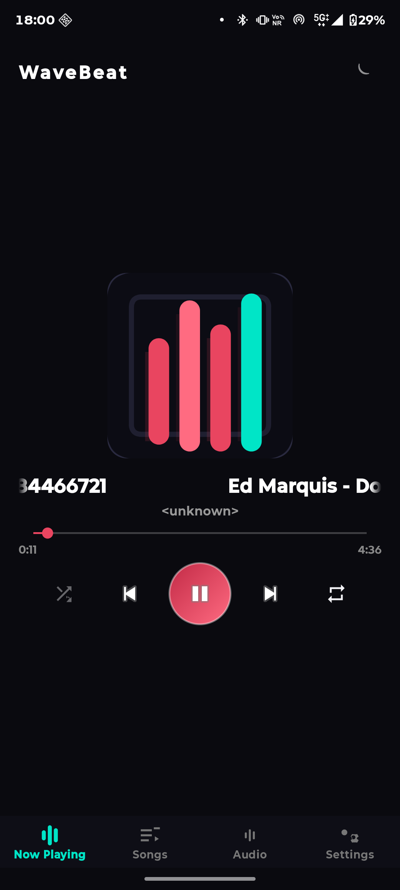
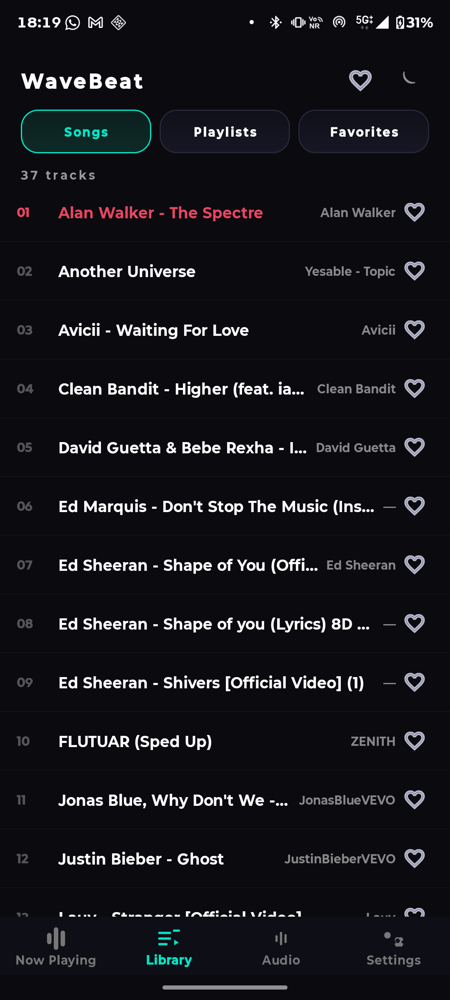
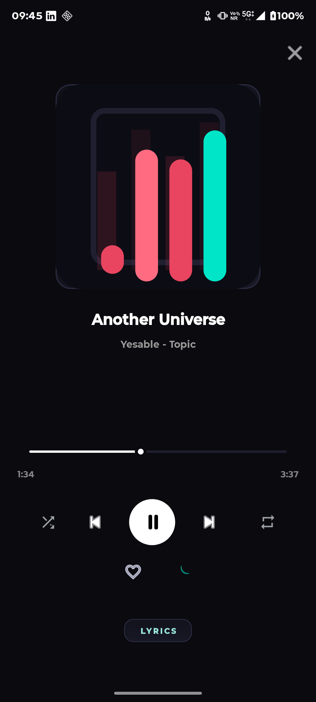
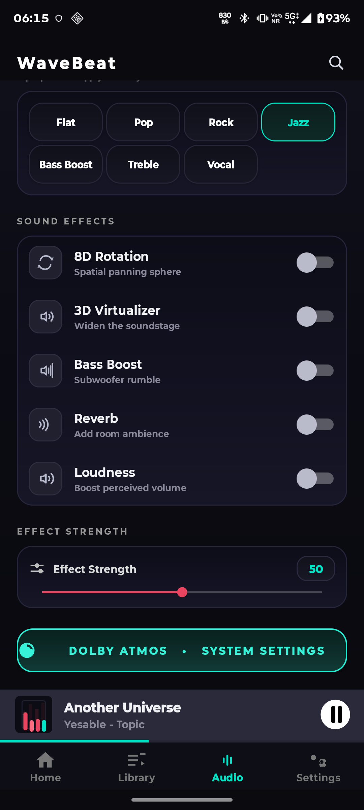

# WaveBeat

A lightweight, offline-first Android music player built with Kotlin and Media3 (ExoPlayer). Beautiful dark UI with haptics, Equalizer, playlists, favorites, and a fully custom player overlay.

## Screenshots

| Home | Songs | Player overlay | Audio |
|:---:|:---:|:---:|:---:|
|  |  |  |  |

## Features

- **Player overlay** — shuffle, prev/next, play/pause, repeat (off / one / all), tap + swipe seek bar
- **Mini player** — title, artist, progress bar, one tap opens the full overlay
- **Library** — full songs list (cached for fast cold start), search filters live
- **Playlists** — create, rename, delete, add songs from a multi-select dialog
- **Favorites** — persist and render across restarts
- **Audio** — equalizer intensity slider, audio presets, bass boost / reverb / loudness, launch into system Dolby / Music Center
- **Auto-pause** — respects audio focus (pauses on interruptions)
- **Auto-next / auto-resume** — configurable from Settings
- **Sleep timer** — dialog-based, per session
- **Lyrics panel** — per track
- **Tweaks** — track haptics, nav-bar haptics, keep-screen-on, animated dance logo, splash screen

Full details in [FEATURES.md](FEATURES.md).

## Requirements

- Android 8.0+ (API 26+)
- Storage access to audio files (MediaStore audio permission)

## Download

Grab the latest APK from the [Releases](https://github.com/rmounikkumar/wavebeat/releases) page and install it on your device.

> The debug APK is signed with the debug key, intended for personal/testing installs.

## Build

```bash
./gradlew assembleDebug
```

APK output: `app/build/outputs/apk/debug/app-debug.apk`

Install on a connected device:

```bash
adb install -r app/build/outputs/apk/debug/app-debug.apk
```

## Tech Stack

- Kotlin
- AndroidX (core-ktx, appcompat, material)
- Media3 ExoPlayer + media3-session
- Custom views & drawables for the equalizer, mini player, and animated logo

## Project Structure

```
app/src/main/java/com/wavebeat/
├── MainActivity.kt       # Main UI: tabs, library, player overlay, settings
├── MusicService.kt       # Media3 service: playback, equalizer, auto-next/resume
├── SongListActivity.kt   # Song listing screen
├── SplashActivity.kt     # Splash + animated logo
└── DancingLogoDrawable.kt# Dancing logo animation
```

## License

Released under the [MIT License](LICENSE).